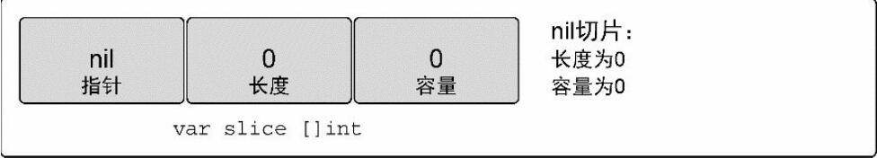
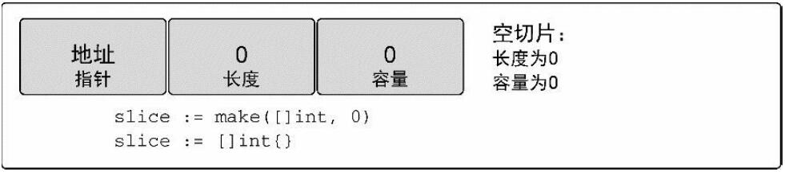
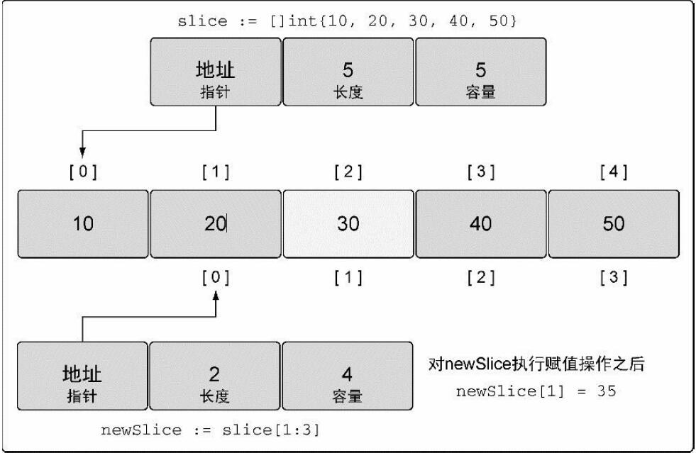
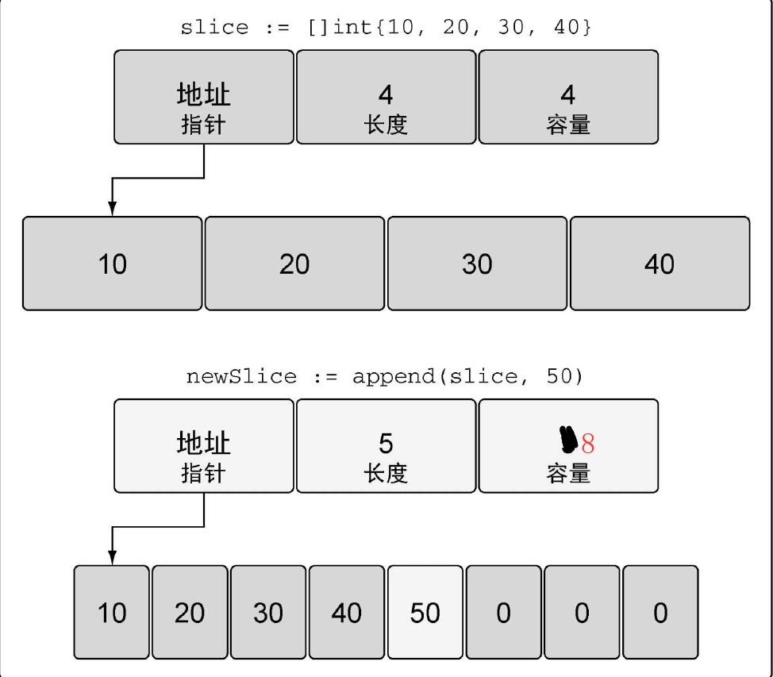
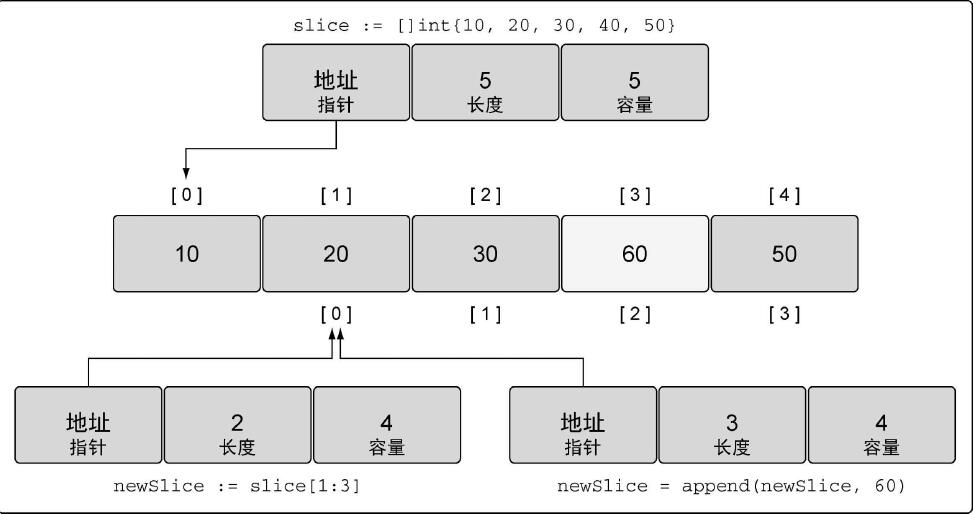
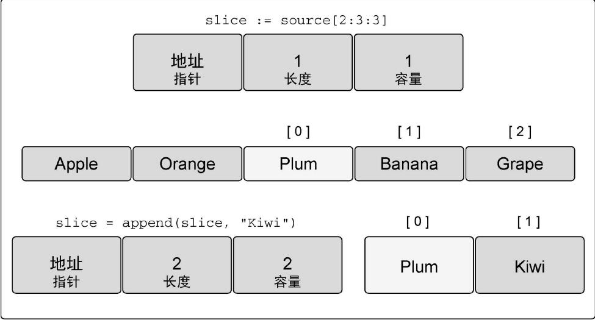

#### 切片

##### 切片的基本原理
切片可以理解为动态数组的实现，切片是一个对象，有自己的方法和属性，切片是一个引用类型。

切片需要3个字段，这3个字段分别是：
指向底层数组的指针
切片访问的元素的个数（即长度）length
切片允许增长到的元素个数（即容量）cap

##### 切片的声明和赋值

###### 使用内置的make()函数
```go
// 创建一个字符串切片
// 其长度和容量都是5个元素
slice := make([]string, 5)
```
```go
// 创建一个整型切片
// 其长度为3个元素，容量为5个元素
slice := make([]int, 3, 5)
```

###### 切片字面量
```go
// 创建字符串切片
// 其长度和容量都是5个元素
slice := []string{"Red", "Blue", "Green", "Yellow", "Pink"}
```
```go
// 创建一个整型切片
// 其长度和容量都是3个元素
slice := []int{10, 20, 30}
```
```go
// 使用空字符串初始化第100 个元素
// 其长度和容量都是100个元素
slice := []string{99: ""}
```

###### 和数组的区别
```go
slice := []string{99: ""}
//[]里没有数字是切片
```
```go
array := [...]string{99: ""}
//[]里有数字或者...是数组
```

##### nil切片
声明一个nil切片
```go
// 创建nil整型切片
var slice []int
```


nil切片的作用：
在需要描述一个不存在的切片时，nil切片会很好用。例如，函数要求返回一个切片但是发生异常的时候

##### 空切片

```go
// 使用make创建空的整型切片
slice := make([]int, 0)
// 使用切片字面量创建空的整型切片
slice := []int{}
```


空切片的作用：
想表示空集合时空切片很有用，例如，数据库查询返回0个查询结果时

##### 使用切片

###### 赋值
切片的赋值：
```go
package main

import (
	"fmt"
)

func main(){
	// 创建一个整型切片
	// 其容量和长度都是5个元素
	slice := []int{10, 20, 30, 40, 50}
	// 改变索引为1的元素的值
	slice[1] = 25
	fmt.Println(slice)
	// [10 25 30 40 50]
}
```
从赋值可以看出，实际上切片就是动态数组

###### 通过现有切片创建新切片
```go
// 创建一个整型切片
// 其容量和长度都是5个元素
slice := []int{10, 20, 30, 40, 50}
// 创建一个新切片
// 其长度为2个元素，容量为4个元素
newSlice := slice[1:3]

fmt.Println(slice)
// [10 20 30 40 50]
fmt.Println(newSlice)
// [20 30]
```
slice的长度为5
这里`slice[1:3]`生成的newSlice
长度：`3-1=2`
容量：`5-1=4`

即slice的长度为k
这里`slice[i:j]`生成的newSlice
长度：`k-i`
容量：`k-j`

注意：现在两个切片共享同一个底层数组。如果一个切片修改了该底层数组的共享部分，另一个切片也能感知到

也就是说`slice[i:j]`切片是浅复制



###### append方法添加新元素
案例一：
```go
// 创建一个整型切片
// 其长度和容量都是4个元素
slice := []int{10, 20, 30, 40}
// 向切片追加一个新元素
// 将新元素赋值为50
newSlice := append(slice, 50)
// newSlice的length为5，cap为8
fmt.Println(newSlice)
// [10 20 30 40 50]
```
这说明内置的append方法实现了动态数组的容量变化，切片长度超出容量上届时自动扩容



案例二：
```go
// 创建一个整型切片
// 其长度和容量都是5个元素
slice := []int{10, 20, 30, 40, 50}
// 创建一个新切片
// 其长度为2个元素，容量为4个元素
newSlice := slice[1:3]
// 使用原有的容量来分配一个新元素
// 将新元素赋值为60
newSlice = append(newSlice, 60)
fmt.Println(slice)
// [10 20 30 60 50]
fmt.Println(newSlice)
// [20 30 60]
```

案例二中append使得newSlice增加了长度，但是应该注意slice[i:j]是浅复制，而且实际上是一个指向同一个数组的指针，因此直接将原切片的值修改成为60

示意图：


##### 第三个索引
第三个索引可以确定容量
对于`slice[i:j:k]` 或`[2:3:4]`
长度: `j – i `或`3 - 2 = 1`
容量: `k – i `或`4 - 2 = 2`

设置第三个索引和第二个索引一样，可以使得新切片的长度和容量相等。

这样的好处是什么呢？

当切片的长度和容量相等时，再调用append就会扩容。但是扩容后的新切片就不会和原数组共用一个底层数组了。
这时候修改新切片的值就不会干扰原切片的值。
```go
// 创建字符串切片
// 其长度和容量都是5个元素
source := []string{"Apple", "Orange", "Plum", "Banana", "Grape"}
// 对第三个元素做切片，并限制容量
// 其长度和容量都是1个元素
slice := source[2:3:3]
// 向slice追加新字符串
slice = append(slice, "Kiwi")
slice[0]="newItem"
fmt.Println(source)
// [Apple Orange Plum Banana Grape]
fmt.Println(slice)
// [newItem Kiwi]
```
示意图：


##### append合并多个切片
```go
// 创建两个切片，并分别用两个整数进行初始化
s1 := []int{1, 2}
s2 := []int{3, 4}
// 将两个切片追加在一起，并显示结果
fmt.Println(append(s1,s2...))
// append连接2个切片时只能一次连接2个
```

##### 遍历切片
###### 使用range遍历
可以看出遍历切片方式与数组相同
```go
// 创建一个整型切片
// 其长度和容量都是4个元素
slice := []int{10, 20, 30, 40}
// 迭代每一个元素，并显示其值
for index, value := range slice {
　fmt.Printf("Index: %d　Value: %d\n", index, value)
}
```

###### for遍历,len(),cap()
```go
slice := []int{10, 20, 30, 40}
for i:=0;i<len(slice);i++ {
	fmt.Println("value:",slice[i])
}
```

len()返回切片长度 length
cap()返回切片容量 cap

##### 函数中传入切片
对比之前的数组，切片的优势不言而喻。

因为切片本身就是引用类型，在64位架构的机器上，一个切片需要24字节的内存：指针字段需要8 字节，长度和容量字段分别需要8字节。