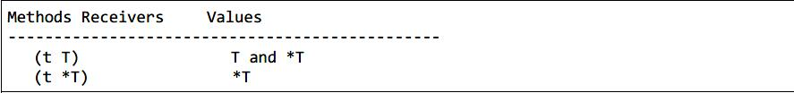

#### Go接口

##### 接口的含义

从面向对象的语言的角度来说，就是约束类(对象)的属性和方法。

比如java或者typescript

##### go中的接口的使用和方法集

看看接口的使用方法

```go
package main

import (
    "fmt"
)


type printInfor interface {
	printInfo()
}

type user struct {
    name string
    email string
}

func (u *user) printInfo() {
    fmt.Println("name:", u.name, " email:",u.email)
}

func main() {
    u := user{"Bill", "bill@email.com"}
    sendInfo(&u)//这里只能传递指针！！
    //写成sendInfo(u)行不行？
}

func sendInfo(p printInfor) {
    p.printInfo()
}
```
Q:这里写成sendInfo(u)行不行?
A:不行

Q:为什么?
A:和go的方法集有关

##### go的方法集
示意图：

指针接收者来实现一个接口，那么**只有指向那个类型的指针才能够实现对应的接口**

如果使用值接收者来实现一个接口，那么那个类型的值和指针都能够实现对应的接口

回到这段代码上，因为接口包含一个`printInfo`方法。而`printInfo`方法接受指针，那么**只有指向那个类型的指针才能够实现对应的接口**，即代码中的`&u`

##### 更加深层次的考虑为什么方法集是这样子的设计的？

因为**编译器并不是总能自动获得一个值的地址**

回到刚才那段程序如果写成
```go
sendInfo(u)
```
而在`sendInfo`中使用`p.printInfo()`时其实是在调用`(*p).printInfo()`。根据**编译器并不是总能自动获得一个值的地址**，`p`可能取不到地址，因此会出现错误。

